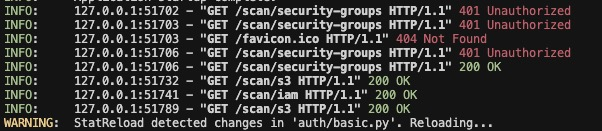
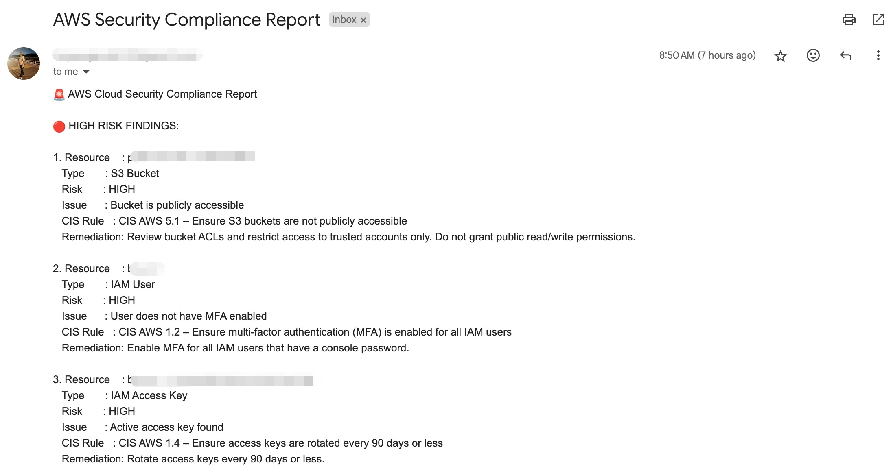
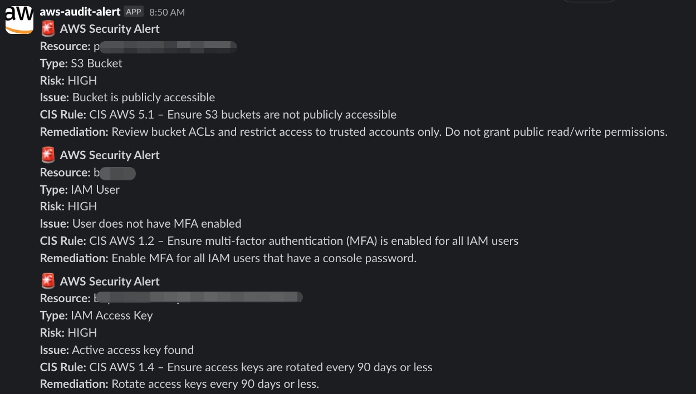
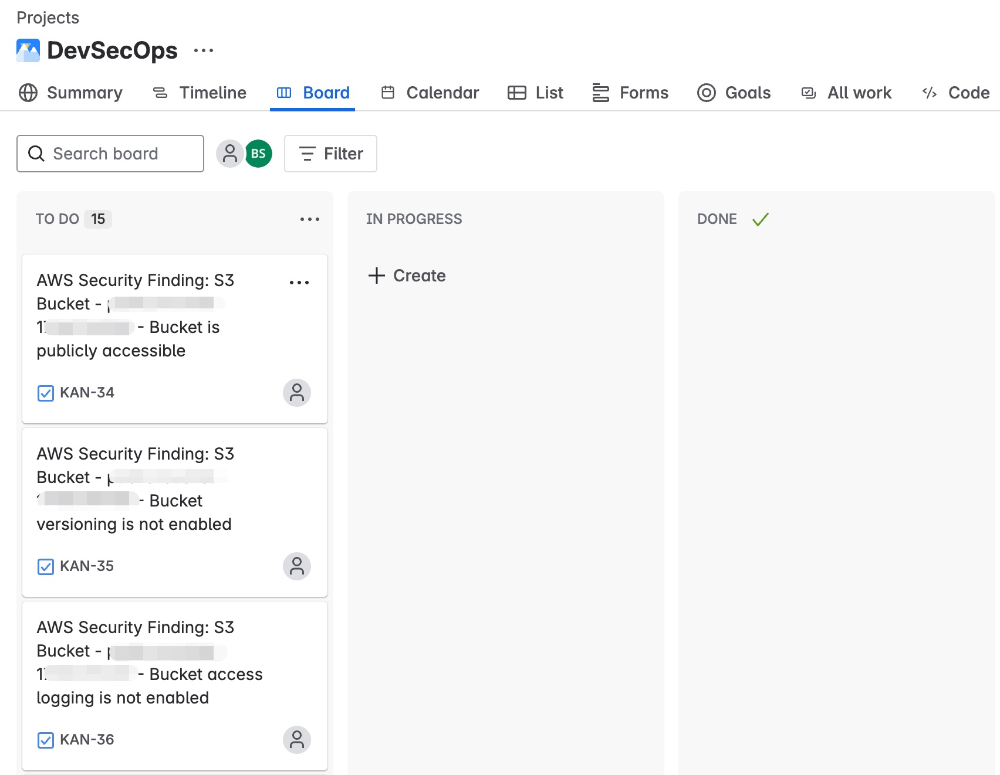

# amartha-aws-auditor

## AWS Security Auditor

An automated tool to scan AWS resources for security misconfigurations based on best practices and integrate findings into workflow tools like Email, Slack, and Jira.

### Table of Contents

- [Features](#features)
- [Prerequisites](#prerequisites)
- [Installation](#installation)
- [Configuration](#configuration)
- [How to Run](#how-to-run)
  - [Locally](#locally)
  - [Via GitHub Actions (CI/CD)](#via-github-actions-cicd)
- [Outputs](#outputs)
- [Project Structure](#project-structure)

### Features

- **AWS Resource Scanning:** Scans S3 Buckets, IAM Users and Policies, EC2 Instances, and Security Groups.
- **Security Checks:** Implements checks based on CIS AWS Foundations Benchmarks.
- **Risk Level Classification:** Classifies findings into HIGH, MEDIUM, and LOW risk levels.
- **Automated Notifications:** Sends alerts via Email and Slack for high and medium risk findings.
- **Jira Ticket Creation:** Automatically creates or updates Jira tickets for high and medium risk findings, including remediation steps.
- **Finding Sanitization:** Redacts sensitive information from findings before reporting.


### Prerequisites

- Python 3.6+
- pip
- Docker (for containerized runs or local testing)
- AWS Account and configured credentials with necessary permissions to describe S3, IAM, EC2, and Security Group resources.
- Access to configure GitHub Secrets for CI/CD.
- (Optional) SMTP server details for Email notifications.
- (Optional) Slack webhook URL for Slack notifications.
- (Optional) Jira account details (domain, email, API token, project key) for Jira integration.

### Installation

1.  Clone the repository:
    ```bash
    git clone https://github.com/[your-org]/amartha-aws-auditor.git
    cd amartha-aws-auditor
    ```
2.  Install dependencies:
    ```bash
    pip install -r requirements.txt
    pip install -e .
    ```

### Configuration

- **AWS Credentials:** Configure AWS credentials using environment variables (`AWS_ACCESS_KEY_ID`, `AWS_SECRET_ACCESS_KEY`, `AWS_DEFAULT_REGION`) or shared credential files (`~/.aws/credentials`, `~/.aws/config`). For CI/CD, use GitHub Secrets.
- **Notifications & Jira:** Update the `config.yaml` file or use environment variables/GitHub Secrets for:
    - `email`: SMTP server details, recipient, sender.
    - `slack`: Webhook URL (`SLACK_WEBHOOK_URL`).
    - `jira`: Domain, email, API token, project key (`JIRA_DOMAIN`, `JIRA_EMAIL`, `JIRA_API_TOKEN`, `JIRA_PROJECT_KEY`).

    **Note:** The CI workflow (`.github/workflows/ci.yml`) uses GitHub Secrets to pass these configurations as environment variables to the scan script.

### How to Run

#### Locally

1.  Ensure prerequisites are met and dependencies are installed.
2.  Ensure AWS credentials and configuration (`config.yaml` or env vars) are set.
3.  Run the main scan script directly (for command-line scan):
    ```bash
    python main.py
    ```
4.  Run the application as a web server using Uvicorn:
    ```bash
    uvicorn main:app --host 0.0.0.0 --port 8000
    ```

#### Via GitHub Actions (CI/CD)

The `.github/workflows/ci.yml` workflow is configured to run automatically on pushes, pull requests, and a daily schedule.

1.  Set up the required GitHub Secrets in your repository settings:
    - `AWS_ACCESS_KEY_ID`
    - `AWS_SECRET_ACCESS_KEY`
    - `AWS_DEFAULT_REGION`
    - `SLACK_WEBHOOK` (Note: the workflow uses `SLACK_WEBHOOK`, not `SLACK_WEBHOOK_URL`)
    - `SMTP_SERVER`
    - `SMTP_PORT`
    - `SMTP_USERNAME`
    - `SMTP_PASSWORD`
    - `EMAIL_RECIPIENT`
    - `JIRA_DOMAIN`
    - `JIRA_EMAIL`
    - `JIRA_API_TOKEN`
    - `JIRA_PROJECT_KEY`
2.  Push your code to the `main` branch or open a pull request.
3.  Monitor the GitHub Actions workflow run.

### Outputs

- **Console Output:** Progress and error messages during execution.

- **Email Notifications:** Sent to the configured recipient(s) for high and medium risk findings.

- **Slack Notifications:** Sent to the configured webhook URL for high risk findings.

- **Jira Tickets:** Created or updated in the specified Jira project for high and medium risk findings.


### Project Structure

```
.
├── alert/
│   ├── email.py      # Email notification logic
│   └── slack.py      # Slack notification logic
├── config/
│   └── loader.py     # Configuration loading logic
├── jira/
│   └── create_ticket.py # Jira ticket creation logic
├── scanner/
│   ├── ec2.py        # EC2 scanning logic
│   ├── iam.py        # IAM scanning logic
│   ├── rules.py      # CIS rule definitions
│   ├── s3.py         # S3 scanning logic
│   └── sg.py         # Security Group scanning logic
├── tests/
│   ├── test_ec2.py
│   ├── test_iam.py
│   ├── test_s3.py
│   └── test_sg.py
├── .github/
│   └── workflows/
│       └── ci.yml    # GitHub Actions workflow
├── Dockerfile        # Dockerfile for building the application image
├── main.py           # Entry point for running the scanner/API
├── requirements.txt  # Python dependencies
├── config.yaml.example # Example configuration file
└── README.md         # This file
```

### Thank You!
Regards, Boy Suganda Sinaga